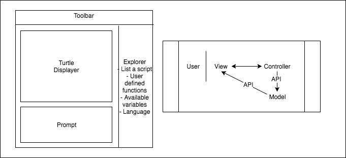

# SLOGO Plan: Team 14(TM)

## Team
* Marcus Oertle (mlo11@duke.edu)
* Collin Brown (cdb55@duke.edu)
* Siyuan Chen (sc456@duke.edu)
* Trishul Nagenalli (tn74@duke.edu)
* Scott Pledger (stp20@duke.edu)

## Specification
* *External API 1* - ModelModifiable (Controller -> Model)
    * API that allows controller to get and modify data from the model. 
    * This interface will be implemented by the model.
    * Can add or delete variables from the model.
* *External API 2* - SLogoValid (View -> Controller)
    * API that allows the Controller to tell the View if an user-input String is valid
    * If not valid, it contains an error message accessible to the Viewer
    * Use: `SLogoValid retMessage = controller.interpret(String s)`
* *Internal API 1* - ModelViewable (Model -> View)
    * API that allows the view access to data from the model
    * Can get list of all viewable objects
    * Can remove objects from that list 
* *Internal API 2* - Interpretor (Model -> Controller)
    * Interprets the command based on the selected language
    * Passes the command onto the Controller to execute if it's a valid command w/ valid arguments
    * Passes SLogoValid object back to View if it's an incorrect command or it's a correct command with invalid arguments


## Introduction
*Problem*: 
* Our team is trying to design an IDE that allows for users to input commands in the Slogo language to update a GUI. 

*Design Goals*:
* API independent of the GUI
* Encapsulate various parts of the program

*Architecture and Design*:
* At the highest level, we plan to use a View-Model-Controller model to seperate out the functions of our program. This will allow the model to be seperated from the GUI by the API so that they could both be extended independent of eachother. 

## Design Overview


* View -- The View class is the wrapper class for all of the different elements of the user interface. It will be responsible for updating given a change in the model.
    * turtle_Display -- The turle display class handles the graphic interface of the model. This includes the turtle and the pen.
        * Turtle -- It's an extension of imageView that contains an X and Y coordinate.
    * prompt -- The prompt handles the text-based user input as well as displays the text based machine response. When the user presses enter of pushes the send button the API between the View and the controller.
    * toolbar -- Where the user can set the language, background color, turtle image, etc.
    * explorer -- Displays a list of scripts, user defined functions, available variables, etc (in the selected language for applicable cases)
* Controller -- The controller takes the user input and manages the normailzation, interpretation, and execution of the data by calling various external classes.
    * interpreter -- Takes the data and normalizes it. This involves translating and turning all commands into a similar format.
    * command -- An abstract class for all types of commands that could be called
        * turtleMoveCommand
        * turtleQueryCommand
        * mathCommand
        * booleanCommand
        * variableCommand
        * controlStructureCommand
        * userDefinedCommand
    * slogoValid -- An abstract class for all types of errors that could be encountered
        * slogoNormal
        * slogoSyntaxError
        * slogoModelError
* Model -- Contains all the data
    * turtle -- contains all the information pertaining to the turtle.
    * Pen -- contains  all the information pertaining to onn

## User Interface
* UI Components (see illustration above for UI design)
    * Turtle display:
        * Displays the Turtle and Pen information
        * The user has no direct influence over this section, all changes will have to go through the prompt 
    * Command prompt:
        * A text interface that works two ways
        * In white is the user input where they can type single and multi-line commands. 
        * In green is the machine's response -- usually doubles after commands
        * In red are errors returned by the machine
    * Toolbar:
        * Series of dropdowns located at the top of the interface
        * Allows the user to select turtle image, pen color, and background color
        * Allows the user to select language
    * Explorer:
        * Series of accordion folders
        * Shows all of the currently avaiable commands and possibly provides documentation

## API Details

```java
/**
* API that allows controller to get and modify data from the model. 
* This interface will be implemented by the model
* 
*/
public interface ModelModifiable {
    /*
    * Adds a variable from the model's String -> Object HashMap
    */
    public double addVariable(String newVar);
    
    /*
    * Deletes a variable from the model's String -> Object HashMap
    */
    public double deleteVariable(String toDelete);

}
```

```java
/**
* API that allows the view access to data from the model
* 
*/
public interface ModelViewable {
    /*
    * Returns a set of all ImageView objects to display on the View
    */
    public Set<Turtle> getTurtles();
    
    /*
    * Gets a list of previously executed commands
    */
    public Set<Command> getPreviousCommands();
    
    /*
    * Gets a map of current variables and their values
    */
    public Map<String, Object> getCurrentVariables();
}
```

```java
/**
* Interprets the command based on the selected language
* Passes the command onto the Controller to execute if it's a valid command w/ valid arguments
* Passes SLogoValid object back to View if it's an incorrect command or it's a correct command with invalid arguments
*/
public interface Interpreter{
    /*
    * Interprets the command and returns a SLogoValid object containing either an error statement or the correct return value
    */
    public SLogoValid interpret(String command);
}
```

```java
/**
* API that allows the Controller to tell the View if an user-input String is valid
* if not valid, it contains an error message accessible to the View
*/
public interface SLogoValid{
    /*
    * Constructor for a SLogoValid object with specific error message or double value
    */
    public SLogoValid(String msg);
    
    /*
    * Get the error message for a SLogoValid object or the associated value if a valid command is entered
    */
    @Override
    public String toString();
    
    /*
    * Check if the user-input String could be executed validly
    */
    public boolean isValid();
}
```

## API Example Code
Case: The user types in 'fd 50' in the command window, and sees the turtle move in the display leaving a trail, and the command is added to the enviroment history.

Within the view class with string S being equal to the user input fd:
```java
SLogoValid retMessage = myInterpreter.interpret(String s);
if(!retMessage.isValid()){
    prompt.errLog(retMessage.toString());
} else {
    prompt.log(retMessage.toString());
}
```

```java
// Inside Controller class
Command c = new xxxCommand();
c.execute(model);
    
// Inside Command class
Turtle newTurtle = new Turtle(); //with new position
model.deleteVariable("turtle");
model.addVariable("turtle", newTurtle);
```

### Individual Use Cases

#### Marcus Oertle
Case 1: User inputs 'towards 1 1' into prompt

```java
// Inside prompt class, in method that the button "run" calls
public run(){
    String s = Textfield.getText();
    SLogoValid retMessage = controller.interpret(String s);
    boolean isValid = retMessage.isValid();
    if(isValid){
        Map<String, Object> variableMap = ModelViewable.getCurrentVariables();
        Set<turtle> turtleSet = new Set<turtle>
        for(String s : variableMap.keys()){
            if(variableMap.get(s) == instanceof(turtle)){
                turtleSet.add(variableMap.get(s));
            }
        }
        if(!turtleSet.isEmpty()){
            TurtleDisplayer.draw(turtleSet);
        }  
    }
    else{
        ErrorPrinter(retMessage.toString);
    }
}

```

Case 2: Turtle GUI needs to be updated when ModelViewable returns

```java
// Inside turtle display class
private Group root;

public draw(Set<turtle> s){
    eraseCurrentDisplay();
    drawNewDisplay(s);
}

public eraseCurrentDisplay(){
    root.getChilldren.removeAll();
}

public drawNewDisplay(Set<turtle> s){
    for(turtle t : s){
        drawTurtle(t);
        if(!t.getLinesSet.isEmpty()){
            drawLines(t.getLinesSet);
        }
    }
}
```

#### Collin Brown

Case 1:

```java

```

Case 2:

```java

```

#### Siyuan Chen

Case 1: User wants to declare and initialize a numeric variable "length"

```java
    myModel.addVariable("length", 20);
    
public class Model implements ModelViewable, ModelModifiable{
    HashMap<String, Object> myModel;
    
    public SLogoValid addVariable(String s, Object value) {
        if (!myModel.keyset().contains(s)) {
            myModel.put(s, value);
            return new SLogoValid(0.0.toString());
        }
        else {
            return new SLogoValid("Variable already exists");
        }
    }
}
```

Case 2: Turtle needs to move 50 steps

```java
    Command c = new TurtleMoveCommand(50, "forward");
    c.execute(model);
    
        // Inside Command class
        Turtle newTurtle = new Turtle(); //with new position
        model.deleteVariable("turtle");
        model.addVariable("turtle", newTurtle);
```

#### Trishul Nagenalli

Case 1: User creates a new variable 'foo' which gets updated in database

```java
ModelViewable model;
Group sideBar;
...
public updateExplorer() {
    sideBar.getChildren().clear();
    for (String varName: model.getCurrentVariables()) {
        Object val = model.get(varName);
        // Class to be defined that will represent a component in the 
        // sidebase that utislizes val's toString() method.
        VarComponent var = new VarComponent(varname, val);
        sideBar.getChildren().add(var);
    }
}
```

Case 2:
User wants to change turtle image

```java
// Keeping the turtle's image in the Turtle Class, we define a new command to change a turtle's image which must go through the controller
Interpreter interp;
...
public changeBackgroundImage (String imFilePath) {
    interp.interpret("changeImage turtle1 " + imFilePath)
}
 
```

#### Scott Pledger
Case 1: Command "fd 50" is passed to Controller

```java
private ArrayList<String> commandName;
private ArrayList<ArrayList<String>> arguments;
for(int i = 0; i < commandName.size(); i++){
    String command = commandName.get(i);
    ArrayList<float> args = arguments.get(i);
    if(isTurtleMoveCommand(command)){
        Command c = new TurtleMoveCommand(command, args);
    }
    c.execute(model);
}
```

Case 2: Command "repeat 5 left 30" is passed to Controller

```java
private ArrayList<String> commandName;
private ArrayList<ArrayList<String>> arguments;
for(int i = 0; i < commandName.size(); i++){
    String command = commandName.get(i);
    ArrayList<float> args = arguments.get(i);
    if(isUserDefCommand(command)){
        Command c = new UserDefCommand(command, args);
    }
    c.execute(model);
}
```

## Design Considerations
* At this moment, we believed we have resolved all of the major issues. We discussed at length many different cases that can occur and how we will handle them.

* Error Handling:
    One of the biggest discussions that we had was surrounding error handling because all errors would have to be passed back to the prompt in the same manner that the returned doubles were. Ultimately, we decided that creating a class called slogoValid that could contain either an error or a double value would be the best solution. This is largely because it would allow a streamline way to print the error to prompt, determine where errors occured in the interpretting process, and allow for a seamless continuation of the thread. The alternative solution we thought of would simply be throwing errors and printing them to the prompt through a seperate API but this would have required a lot of additional code and reduce the amount of  encapulation.
    
* Interpreting and Executing
    Another major design discussion we had was regarding the interpreting and execution of the program. In the end, we decided the best way to handle this would be to have an interpreting turn the command into a normalized expression that then would be passed to a controller class that would create specific command objects for each valid command. The benefit of doing this was that it will significantly reduce the amount of 

## Team Responsibilities
* Front End
    * Marcus Oertle
        * Turtle displayer + error display
            * takes in list of objects
            * update turtle location as ImageView object
            * draw/remove lines as specified by the turtle class
        * Prompt
            * take in user input
            * pass user input as string to:
                * `SLogoValid interpret(String command)`
    * Trishul Nagenalli
        * Getting information about state and display in the Explorer
        * Displaying previously executed commands
        * Toolbar & Loading User Defined Functions
        * Main Class Application for Project

* Back End
    * Collin Brown
        * Interpreter
        * Command Superclass
            * TurtleMoveCommand
            * TurtleQueryCommand
            * MathCommand
            * BooleanCommand
    * Siyuan Chen
        * Model and its two APIs
        * other Command subclasses
    * Scott Pledger 
        * Controller
            * VariableCommand
            * ControlStructureCommand
            * UserDefinedCommand